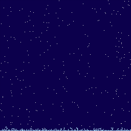
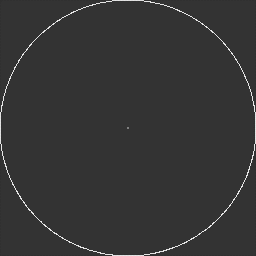
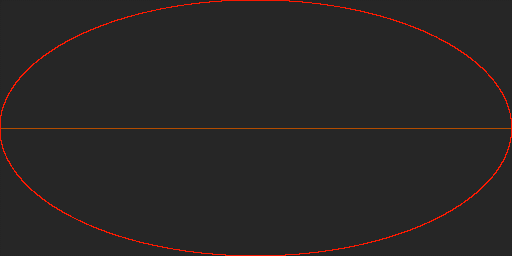

This code work is under an MIT licence, for more info see below.

# About:
A diffusion-limited aggregate script where particles undergo a random walk until they collide with an aggregate whereupon they are added to the "agg". Designed for Windows-based systems, but it ought to work for any OS.

I wrote this in python as a personal project in particle simulation complexity science. In addition to the serious applications (models like this are used in simulation of chemical reactions, plant and coral growth, state changes in materials, biophysics, *etc.*) it's also good for making funky "brownian crystals" (aka "DLA clusters") - one can also use the `animate` toggle in `parameters.py` to watch the dots move in real time (note: since the time between frames is locked here, you will want to boost the number of simultaneously simulated particles (`simpoints`), which is both prettier to watch and also is set fairly low in the current parameters file, since using fewer points allows for many more frames to be run in the same time period especially on weaker hardware).

Uses MatPlotLib to render a board of `particles` or `parts`, which are stored as sets of tuples of coordinates (another option would be storing a (sparse) matrix and updating that, but it's not the method used here primarily because this is more tweakable)

During the run, each new addition to the `aggregate` or `agg` is logged in a csv in `/data/<start time in %Y.%m.%d.%H.%M format>`, and stills of the process are captured as according to the `frames to snag` setting used in config.ini (The next update will add a gui for selecting a directory and adding settings)

Note: When resuming a run (setting `continue_previous_run` to `true`, `1`, `yes`, or `on`), config.ini will load the config file from `prev_run`, and use those settings. Updating, renaming, or deleting that file causes the settings in the main directory's config.ini to be kept active.

Config.ini has a lot of annotation, so please read that for more information on settings.

# How to Use:
You'll need Python 3, NumPy, and MatPlotLib. After that simply start up your terminal and run `main.py`

Each run collects data about the time, frame, and location of any particles that collide with the aggregate, and logs these data to a .csv file
You can use this information to do all sorts of experiments on system interactions and properties of aggregate growth. Please share any cool findings!

## Fun settings
These are more about looking pretty than doing serious science, but then again the project *does* have a `generative art` tag on it.

### Snow

- animate set to `true`, `1`, `yes`, or `on`
- `cmap = colors.ListedColormap([[0,0,0.2], [1,1,1], [0.7,0.9,1]])`
- disallow any lines with `y-1` from `movement_options` (or add additional `y+1`s)
- `starting_agg` as `bottom` or "`{(bounds[0]-1,i) for i in range(bounds[1])}`"
- `spawnsquares` as "`top`" or "`{(0,i) for i in range(bounds[1])}`"
- the `bounds`, `simpoints`, and `dot_sidelength_in_pixels` as whatever looks nice and runs well on your rig
- You may want a custom spawnsquares like "" to help the particles even out more quickly

### Petri Dish aka Clock Face

- spawnsquares = center4 (or everywhere)
- starting_agg = ellipse

### Evil Eye aka Ring Lord

- Similar to the petri dish
- Bounds wider than tall and `movement_options` tweaked to make horizontal movement more common

# Dependencies
- Python 3
- numpy
- matplotlib

# License

Basically you can do anything they want with this code as long as you give me credit for anything you do. Also you don’t hold me liable if somebody finds a way to harm someone else by using it.

MIT License

Copyright (c) [year] [fullname]

Permission is hereby granted, free of charge, to any person obtaining a copy
of this software and associated documentation files (the "Software"), to deal
in the Software without restriction, including without limitation the rights
to use, copy, modify, merge, publish, distribute, sublicense, and/or sell
copies of the Software, and to permit persons to whom the Software is
furnished to do so, subject to the following conditions:

The above copyright notice and this permission notice shall be included in all
copies or substantial portions of the Software.

THE SOFTWARE IS PROVIDED "AS IS", WITHOUT WARRANTY OF ANY KIND, EXPRESS OR
IMPLIED, INCLUDING BUT NOT LIMITED TO THE WARRANTIES OF MERCHANTABILITY,
FITNESS FOR A PARTICULAR PURPOSE AND NONINFRINGEMENT. IN NO EVENT SHALL THE
AUTHORS OR COPYRIGHT HOLDERS BE LIABLE FOR ANY CLAIM, DAMAGES OR OTHER
LIABILITY, WHETHER IN AN ACTION OF CONTRACT, TORT OR OTHERWISE, ARISING FROM,
OUT OF OR IN CONNECTION WITH THE SOFTWARE OR THE USE OR OTHER DEALINGS IN THE
SOFTWARE.
